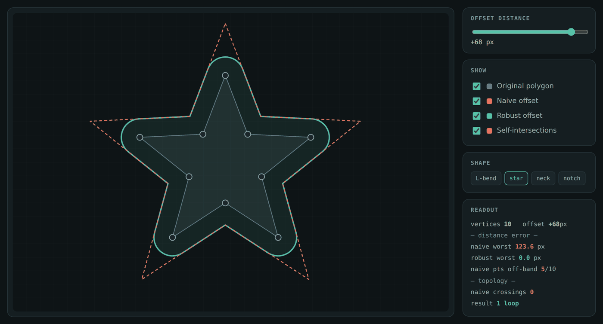

# Polygon Offset Playground

An interactive, dependency-free demo of **polygon offsetting** — the operation behind a CNC toolpath, a seam allowance in a garment pattern, a clearance boundary in a PCB, a stroke outline in a vector editor.

**[▶ Open the demo](https://marcelasampaio.github.io/polygon-offset/)** · drag any vertex, drag the offset distance, watch the naive method come apart.



---

## The problem

Offsetting a polygon by a distance `d` sounds like moving every vertex along its angle bisector. That is what the red curve in the demo does, and on a convex polygon it looks fine.

It is wrong, and the demo measures *how* wrong. Bisector displacement puts a vertex at `d / sin(θ/2)` from the original corner, not at `d`. At a sharp corner `θ → 0` and the error runs away. On the default star at `d = +68px`, the worst point on the naive result sits **123.6px** from the source polygon instead of 68px — off by 82%.

That is the honest failure mode, and it is the one people miss. The textbook complaint about naive offsetting is self-intersection; on these shapes the naive curve mostly does not self-intersect. It simply lands in the wrong place, quietly, and a part machined from it is the wrong size.

## The approach

The green curve is built the way a real offsetting routine is:

1. **Offset each edge independently** along its own normal — every edge lands at exactly distance `d`, by construction. No bisectors.
2. **Rejoin the gaps.** At a convex corner the two offset edges leave a wedge, filled with an arc fan around the original vertex (18 segments), so the result stays at `d` through the turn. At a reflex corner the offset edges *overlap*, so they are trimmed to their infinite-line intersection and the overshoot is discarded — with a miter cap so a near-degenerate corner cannot throw a spike to infinity.
3. **Densify, then filter by distance.** Each edge is sampled at ~5px. Any sample whose true distance to the source polygon is not `|d|` is dropped, which is what removes the loops that appear when the offset distance exceeds the local feature size and the topology has to change.

Supporting routines, all from scratch: signed-area orientation (CCW), even-odd ray-cast point-in-polygon, point-to-segment distance, segment intersection.

## The metric

The panel reports, for both curves:

```js
function bandError(pts, poly, d) {      // how far the result really is from distance |d|
  var ad = Math.abs(d), worst = 0, off = 0;
  for (var i = 0; i < pts.length; i++) {
    var err = Math.abs(distToPoly(pts[i], poly) - ad);
    if (err > worst) worst = err;
    if (err > ad * 0.08 + 1.5) off++;
  }
  return { worst: worst, off: off, n: pts.length };
}
```

`worst` is the largest deviation from the requested distance across every sampled point. On the robust path it reads **0.0px** on all four test shapes; on the naive path it grows with corner sharpness. This is a correctness check, not a rendering check — the picture can look plausible while the numbers are bad, which is exactly the trap.

## Test shapes

| Shape | What it exercises |
|-------|-------------------|
| `L-bend` | one reflex corner — the simplest case the naive method gets wrong |
| `star` | alternating sharp convex and reflex corners; bisector error is extreme |
| `neck` | a narrow waist — inward offset must split the polygon into two loops |
| `notch` | a thin slot that closes up and vanishes under inward offset |

## Running it

Open `index.html`. No build, no dependencies, no network — one file, plain Canvas 2D and about 300 lines of geometry.

---

MIT licensed. Built by [Marcela Sampaio](https://github.com/marcelaSampaio).
